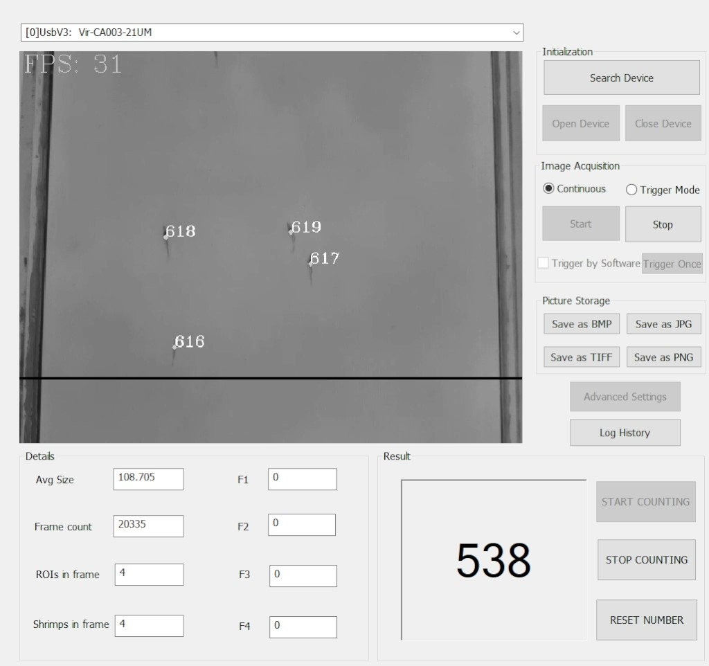

# Shrimp Counter
A simple sofware for tracking and counting the number of shrimp passing through the chute
# Example

# Setting screen

# Feature
+ Connect to Camera Hikrobot
+ Background subtraction to extract contours
+ Hu-moment to get 7 features of contours
+ SVM to classify the number of shrimp in contours
+ SORT for tracking ID
+ Count shrimps passed the line
# Install 
Run file: SetupProject/Release/setup.exe

